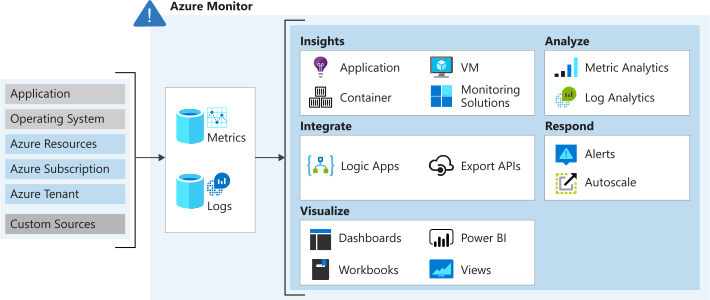

# Analyze your Azure infra by using Azure Monitor logs
Collecting & analyze telemtry. How apps are perfoming & identifies any issues. Collects:
- Metrics
- Logs

## Data sources
- **App data**: custom app code
- **OS data**: data from WinD/Linux VM
- **Azure resource data**: operations of an Azure resource
- **Azure sub data**: (e.g. Azure health & availability)
- **Azure tenant**: (e.g. Azure AD)

Is an automatic system for VMs and web apps. Extend by:
- **Enabling diagnostics**: in resources that is not enabled (e.g. Azure SQL Databases)
- **Adding an agent**: for VMs install the Log Analytics agent & configure it to send data to a Log Analytics
workspace.

You can send data from custom code calling the **Data Collector API**.

## Logs
Time-stamped information about changes made to resources. Organized into records (diff set of properties). 
Mostly, text data. Most common are events.

## Metrics
Numerical values. Stored in a time-series database.