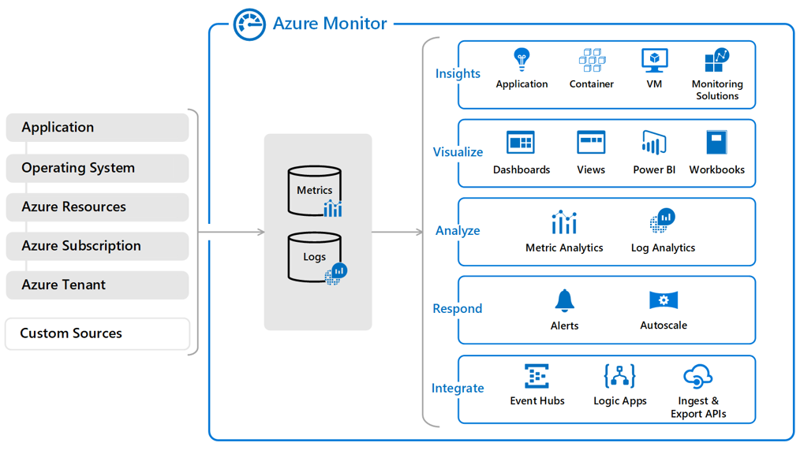

# Azure Monitor
- **Monitor & Visualize metrics**. Health, operation & performance.
- **Query & Analyze logs**. Activity and diagnostic logs, telemtry from monitoring solutions. Analytics queries 
for troubleshooting & visualizations.
- **Setup alerts & actions**. Take automated corrective actions based on triggers.

## Components
Collecting & analyzing data (performance, health, availability). Proactively watching critical issues (solve 
before they become severe). You can hybrid monitoring environment.

## Define metrics & logs
- *Metrics*: numerical. Describe some aspect of a system at a particular point in time. (Real-time, lightweight)
- *Logs* (Logs Analytics): events & traces. Uses KQL (aggregations, joins, smart analytics) to quickly 
retrieve, consolidate, and analyze collected data. Analyze, save queries, visualize data, create alert rules.

## Data types
- **App monitoring**: performance & funcionality of code.
- **Guest OS monitoring**: OS.
- **Azure resource monitoring**: operation of an Azure resource.
- **Azure sub monitoring**: operation & management of an Azure sub (health & operation of Azure).
- **Azure tenant monitoring**: operation of tenant-level Azure services (Azure AD).

- **Azure Monitor**: Starts collecting data as soon as you create an Azure sub & add resources.
- **Activity Logs**: record when resources are created/modified.
- **Metrics**: how resource is performing & the resources consuming

You can add an agent to compute resources. Also, Azure Monitor can collect log data from any REST client using
the Data Collector API.

## Activity Log events
Sub log that provides insight into sub-level events that occurred inAzure. ARM operational data to updates on
Service Health events. *what, who, and when* for any write opeations (**PUT**, **POST**, **DELETE**) taken on 
the resources in your sub. Status of operation & other relevant properties. Kept for 90 days. Use Portal, CLI, 
PowerShell, REST API.

## [Query the Activity Log](https://learn.microsoft.com/en-us/training/modules/configure-azure-monitor/7-query-activity-log)
Filters: Subscription (1+), Timespan, Even severity, Resource Group, Resource (name), Resource type, Operation 
name, Event initiated by (caller), Search.

### Event categories
- **Administrative**: Create, update, delete, and action operations performed through ARM.
- **Service Health**: Health incidents in Azure.
- **Resource Health**: Resource health events to your Azure resources.
- **Alert**: activations of Azure alerts.
- **Autoscale**: events related to the autoscale engine.
- **Recommendation**: Better utilize your resouces.
- **Security**: Alerts generated by Azure Defender for Servers.
- **Policy**: All effect action operations performed by Azure Policy.