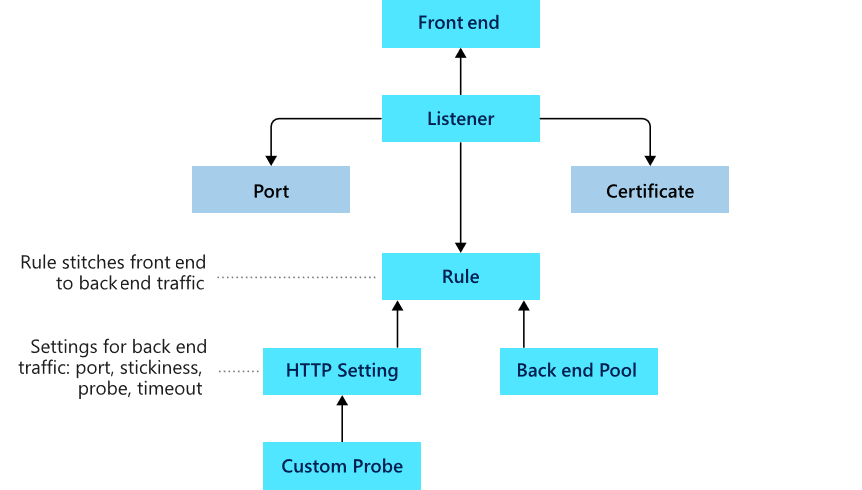

# Application Gateway
Manage the requests that client apps send to a web app. App layer routing, routes traffic to a pool of web
servers based on the URL of a req. Pool can include:
- Azure VM
- Azure VM scale sets
- Azure App Service
- On-premises servers

Round robin. Session stickiness (ensure client requests in the same session are routed back to the same 
back-end server).

Features:
- HTTP, HTTPS, HTTPS/2, WebSocket
- Web app firewall
- End-to-end req encryption
- Autoscaling

## Routing
**Path-based**: direct diff URL requests paths to diff pools of back-end servers.
**Multiple site**: configure + than 1 web app on the same app gateway instance. Multi-tenant.
- Redirection
- Rewrite HTTP headers
- Custom error pages

## [Components](https://learn.microsoft.com/en-us/training/modules/configure-azure-application-gateway/4-app-gateway-components)

Routing rules interpet the hostname & path elements in the URL of a request.

You can use an Web App Firewall to prevent from:
- SQL injection
- Cross-site scripting
- And more
Health probe HTTP response should be between 200 and 300