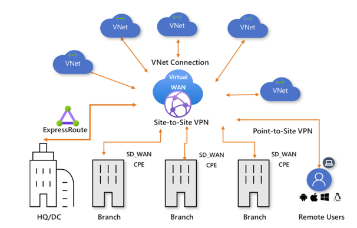

# ExpressRoute and Virtual WAN

## [ExpressRoute](https://learn.microsoft.com/en-us/training/modules/configure-expressroute-virtual-wan/2-determine-expressroute-uses)
Extend your on-premises networks into the Microsoft cloud via a connectivity provider. Don't go 
through the public internet (private connection). ExpressRoute is best for handling 
enterprise-class and mission-critical workloads. Works with an approved connectivity provider.
- \+ reliability (bandwidths up to 100 Gbps)
- Faster speeds
- Lower latencies

Good for:
- Periodic data migration
- Replication for business continuity
- Disaster recovery
- Add compute & storage capacity

### [Capabilities](https://learn.microsoft.com/en-us/training/modules/configure-expressroute-virtual-wan/3-determine-expressroute-capabilities)
**ExpressRoute locations** are where Microsoft peers with several service providers.

Benefits:
- **Layer 3 connectivity**: uses BGP to exchange routes.
- **Redudancy**: 2 connections to 2 Microsoft Enterprise edge routers (MSEEs).
- **Connectivity to Microsoft cloud services**
- **Connectivity to all regions within a geopolitical region**
- **Global connectivity with ExpressRoute premium add-on**
- **Across on-premises connectivity with ExpressRoute Global Reach**

### 3 Connection Models
- **Colocated at a cloud exchange**
    - Layer 2 cross-connections
    - Managed Layer 3 cross-connections
- **Point-to-point Ethernet connections**
    - Layer 2 connections
    - Managed Layer 3 connections
- **Any-to-any (IPVPN) networks** (seamless)
    - Managed Layer 3 connectivity

### Intersite connections

## [Virtual WAN](https://learn.microsoft.com/en-us/training/modules/configure-expressroute-virtual-wan/6-determine-uses)
Optimized & automated branch connectivity to, and through Azure. Azure Virtual WAN with Virtual WAN 
hubs simplifies a complex virtual network WAN.
- Connect branches and enjoy branch-to-VNet connectivity

### Advantages
- Integrated connectivity solutions in hub and spoke
- Automated spoke setup and configuration
- Intuitive troubleshooting

### Types
- Basic (site-to-site)
- Std (ExpressRoute, User VPN (P2S). VPN (site-to-site), Inter-hub, and VNet-to-VNet transiting through the virtual hub.)