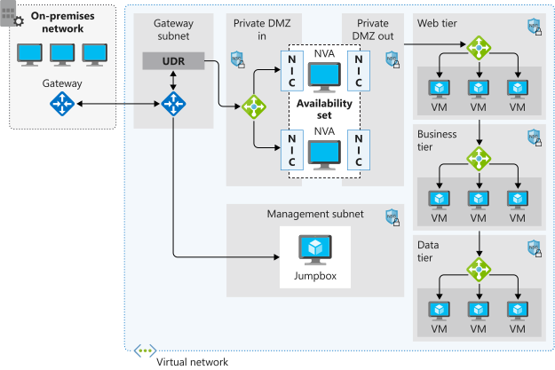

# Network routing & endpoints
Azure implements **system routes** to direct network traffic:
- VMs in the same subnet
- VMs in the same VNet, diff subnet
- Data flow from VMs to the Internet

## User-defined routes
Control net traffic by:
- Defining routes that specify the next hop of the traffic flow
    - VNet Gateway (VPN)
    - VNet (override)
    - Internet
    - Virtual Appliance (firewall device)

Route through firewalls or NVAs.

Route tables can be associate to any quantity of subnets.
Traffic routed to the None next hop type isn't routed outside the subnet, but is dropped.

### Border Gateway Protocol
Std routing protocol used to exchange routing & info among 2+ networks. Transfer data & info between diff host 
gateways. Offers network stability.

## Hop Type
Next can be:
- VNet: in the address prefix.
- Internet: 0.0.0.0/0
- None: is dropped and doesn't get routed outside the subnet. 

## Route selection & priority
Azure uses the longest prefix match (smallest subnet mask). If multiple routes with the same address prefix:
- User-defined routes
- BGP routes
- System routes

## Network Virtual Appliance
Are VMs that control the flow of net traffic by controlling routing. Flowing from a perimeter-net env to other 
nets/subnets.
Components:
- Firewall
- WAN optimizer
- App-delivery controllers
- Routers
- LBs
- IDS/IPS
- Proxies

You can have a front firewall subnet to inspect all packets at OSI Layer 4 and at app layer 7.

Use for: *filter* traffic in to a VNet, block malicious requests, block from unexpected resources.

## [Service endpoints](https://learn.microsoft.com/en-us/training/modules/configure-network-routing-endpoints/4-determine-service-endpoint-uses)
Use VNet private addresses as the source IP addresses when accessing the Azure service from a VNet.

Benefits:
- Remove public Internet access (security)
- Optimal routing
- Keep traffic on the Azure backbone network.
- No extra overhead to maintaining the endpoints.

### Services
- Azure AD
- Cosmos DB
- Cognitive Services
- Container Registry
- Event Hub
- Key Vault
- Service Bus
- SQL
- Storage
- Web

## Private Link
Private connectivity from a VNet to Azure PaaS, customer-owned, or Microsoft partner services.
Works across Azure Active Directory (Azure AD) tenants. Bring services delivered on Azure into your 
private virtual network by mapping it to a private endpoint.
- Private, global.
- Integration with on-premises and peered networks
- Protection against data exfiltration for Azure resource
- Services delivered directly to your customers’ virtual networks.