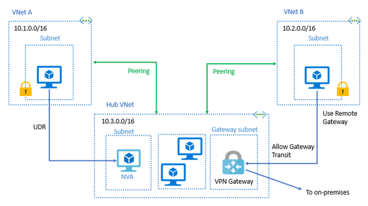

# [Virtual Network Peering](https://learn.microsoft.com/en-us/training/modules/configure-vnet-peering/2-determine-uses)
Seamlessly connect two Azure virtual networks. It is private, fast, can communicate.
- **Regional**
- **Global**: peer with any other region except Gov (they must be in the same).

## Gateway Transit & Connectivity
To permit the transit you must enable a VPN Gateway (1 peer VNet). When `Allow Gateway Transit` the 
VNet can communicate outside the peering. The subnet gateway can:
- site-to-site VPN (connect to an on-premises network)
- VNet-to-VNet connection to another VNet

This can allow all VNet to access outside the peering without having to have a VPN Gateway each one.

## Service Chaining
VNet peering is nontransitive. So, you must connect each VNet you want to communicate between them. 
You must use a *hub and spoke* arch. A hub VNet is created. Each VNet must connect to this via a
Network Virtual Appliance or VPN Gateway.

With this, you can define user routes to direct traffic.

Connectivity:
- Initiated
- Connected

The peering isn't successfully established until the peering status for both virtual network peerings is Connected.

## Diffs
If using CLI or PowerShell, you need to establish peering in both directions. In the Portla n

## Cross-subscription
You can connect VNets from diff subs. If you don't have both subs in the same Azure AD tenant, you must ask 
each administrator to give to the other administrator the **Network Contributor** role.