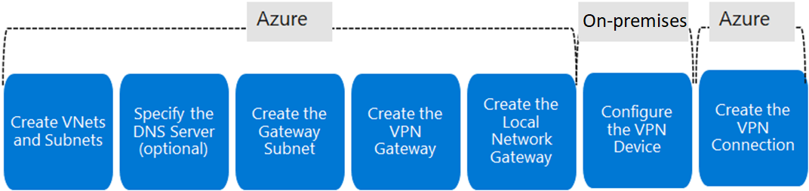

# VPN Gateway
VNet Gateway to send encrypted traffic between an Azure VNet and on-premises over the public 
internet.
- **Site-to-site** on-premises to Azure VNet
- **VNet-to-VNet**
- **Point-to-site** individual devices to Azure VNet

It is composed of 2+ VMs deployed to a gateway subnet. This VMs contain *routing tables* and run 
specific gateway services. Created and configured by default. Can be deployed in AZs.

## Process
- Create VNets and Subnets
- **Create the Gateway Subnet** (better CIDR /28 or /27). Named `GatewaySubnet`.
    - *Gateway type*: VPN or ExpressRoute
    - *VPN type*: Route based or Policy based.
    - *SKU*: tunnels & aggreated throughput benchmark.
    - *Generation*: 1 (Basic & VpnGw1 SKUs) and 2 (VpnGw4 and VpnGw5 SKUs are only)
    - *VNet*

### [VPN types](https://learn.microsoft.com/en-us/training/modules/configure-vpn-gateway/6-determine-type)
- **Route-based**: routes in the IP forwarding or routing table directing traffic to corresponding
tunnel interface. Policy configured as *any-to-any*.
- **Policy-based**: through IPsec tunnels based on IPsec policies config with combinations of 
addresses prefixes between on-premises & VNet. Policy is an access list in the VPN device.
    - Only Basic gateway SKUs
    - 1 tunnel
    - Only S2S connections (certain configs)

### [Local Network Gateway](https://learn.microsoft.com/en-us/training/modules/configure-vpn-gateway/8-create-local-network-gateway)
Usually on-premises. Specify:
- IP or FQDN
- IP addresses prefixes (prefixes located in the on-premises network)

Configure VPN device:
- **Shared key**
- **Public IP address of your VPN Gateway**

### VPN connection
Once both VPN Gateways created, you connec them.
- Name
- Connection type: site-to-site
- Shared key (PSK)

## [High Availability scenarios](https://learn.microsoft.com/en-us/training/modules/configure-vpn-gateway/11-determine-high-availability-scenarios)
- **Active/standby**: the standby will get into game if the Active is disrupted or a planned 
maintenance.
- **Active/active**: Both instances of the gateway VMs will establish S2S VPN tunnels to your 
on-premises VPN device. Each has a unique public IP address.